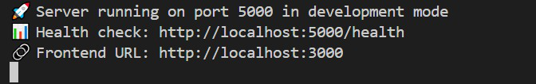
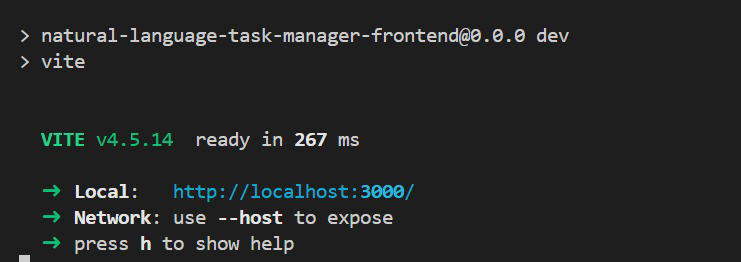
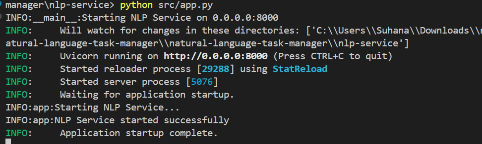

# Natural Language Task Manager

Enterprise-grade task manager with natural language processing capabilities.

## Quick Start

### Prerequisites
- Node.js 18+ 
- Python 3.8+
- PostgreSQL database (or use cloud provider like Supabase)
- OpenAI API key

### Setup Instructions

1. **Clone and setup environment**
```bash
git clone <your-repo>
cd natural-language-task-manager
```

2. **Setup Backend**
```bash
cd backend
npm install
cp .env.example .env
# Edit .env with your database URL
npx prisma generate
npx prisma db push
```

3. **Setup NLP Service**
```bash
cd ../nlp-service
python -m venv venv
source venv/bin/activate  # On Windows: venv\Scripts\activate
pip install -r requirements.txt
cp .env.example .env
# Edit .env with your OpenAI API key
```

4. **Setup Frontend**
```bash
cd ../frontend
npm install
```

5. **Run All Services**
```bash
# Terminal 1: Backend
cd backend && npm run dev

# Terminal 2: NLP Service
cd nlp-service && python src/app.py

# Terminal 3: Frontend
cd frontend && npm run dev
```

6. **Access the Application**
- Frontend: http://localhost:3000
- Backend API: http://localhost:5000
- NLP Service: http://localhost:8000
- API Docs: http://localhost:8000/docs

## Project Structure

## Screenshots from terminal




